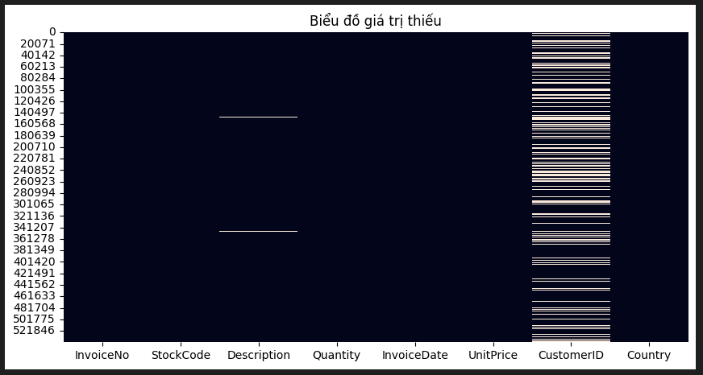
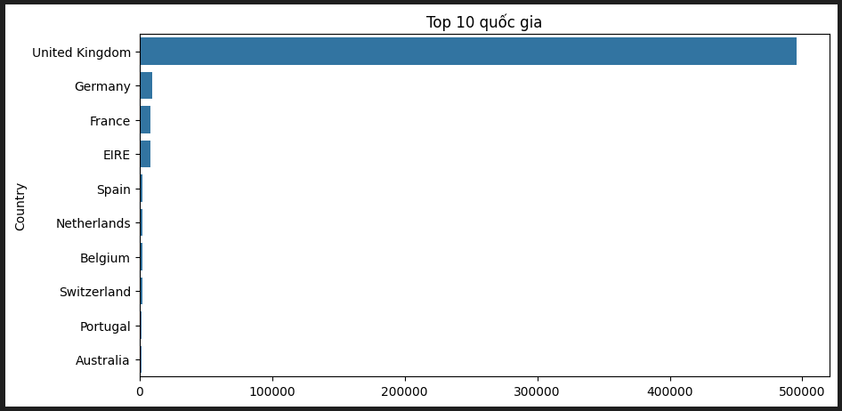
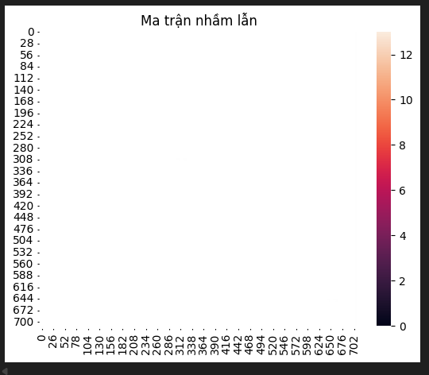
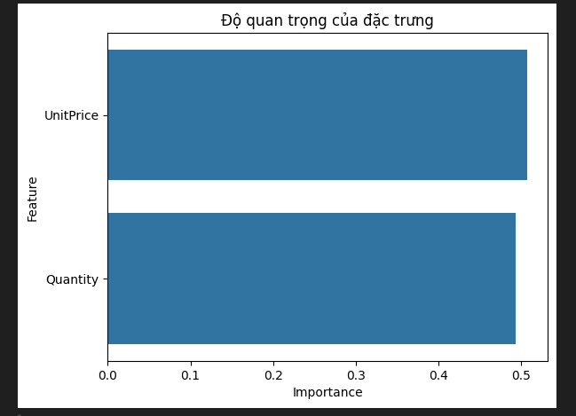

# 🛒 E-commerce Return Prediction using Data Mining

## 📌 Abstract

Trong thương mại điện tử, việc khách hàng trả hàng gây ảnh hưởng lớn đến chi phí vận hành và trải nghiệm người dùng.  
Dự án này sử dụng các kỹ thuật khai phá dữ liệu và học máy để phân tích và dự đoán hành vi trả hàng.

---

## 🎯 Mục tiêu

- Phân tích dữ liệu khách hàng và đơn hàng  
- Xây dựng mô hình dự đoán hành vi trả hàng  
- Áp dụng các kỹ thuật Data Mining:
  - Clustering (KMeans)
  - Association Rules (Apriori)

---

## 📂 Dataset

Dữ liệu bao gồm:
- CustomerID
- Country
- UnitPrice
- Quantity

Biến mục tiêu:
- `Return_Label`: 0 (không trả), 1 (trả hàng)

---

## 📊 Exploratory Data Analysis (EDA)

### 🔹 Missing Values



👉 Nhận xét:
- CustomerID có nhiều giá trị thiếu  
- Cần xử lý trước khi huấn luyện mô hình  

---

### 🔹 Phân bố quốc gia



👉 Nhận xét:
- United Kingdom chiếm phần lớn dữ liệu  
- Dữ liệu bị lệch  

---

## 🤖 Modeling & Evaluation

### 🔹 Confusion Matrix



👉 Nhận xét:
- Mô hình dự đoán khá chính xác  
- Vẫn tồn tại một số lỗi  

---

### 🔹 Feature Importance



👉 Nhận xét:
- UnitPrice và Quantity là 2 yếu tố quan trọng nhất  

---

## ⚙️ Methodology

1. Data Preprocessing  
2. Feature Engineering  
3. Clustering (KMeans)  
4. Association Rules (Apriori)  
5. Modeling & Evaluation  

---
## 👥 Nhóm thực hiện

**Nhóm 8 – Công nghệ Thông tin**

- Lớp: CNTT 1710  
- Chuyên ngành: Phát triển phần mềm  

### Thành viên:
- Nguyễn Thế Ngọc  
- Nguyễn Văn Hiệp
- Phạm Văn Minh
- Nguyễn Lê Đăng Khánh
## 🚀 Cách chạy project

### 1. Clone repo

```bash
git clone https://github.com/ngocviphacker/return-predictiom.git
cd return-predictiom
## 📁 Cấu trúc project
return-predictiom/
│
├── configs/ 
│
├── data/ 
│ ├── raw/ 
│ └── processed/
│
├── notebooks/ 
│
├── outputs/
│
├── scripts/ 
│
├── src/
│ ├── data/ 
│ ├── features/ 
│ ├── models/ 
│ ├── clustering/ 
│ ├── association/ 
│
├── main.py 
├── requirements.txt # Thư viện cần thiết
├── README.md # Tài liệu mô tả project

